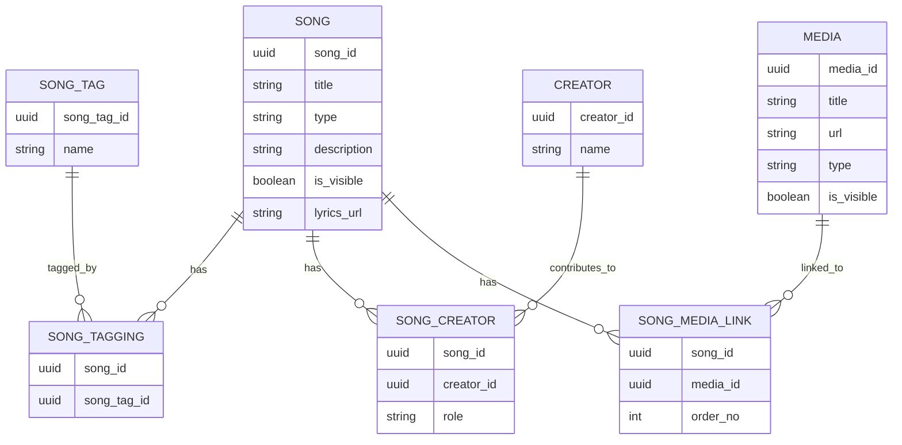
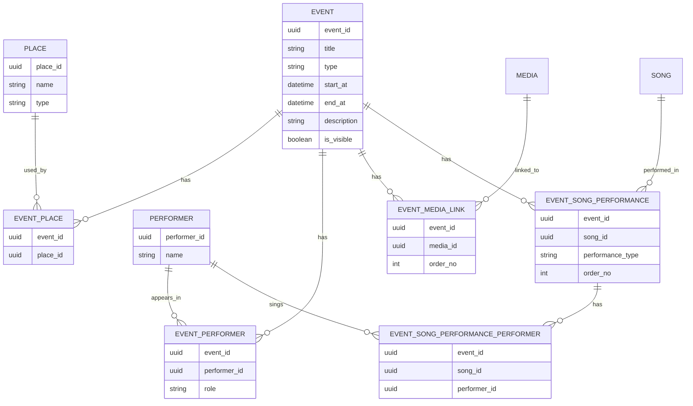
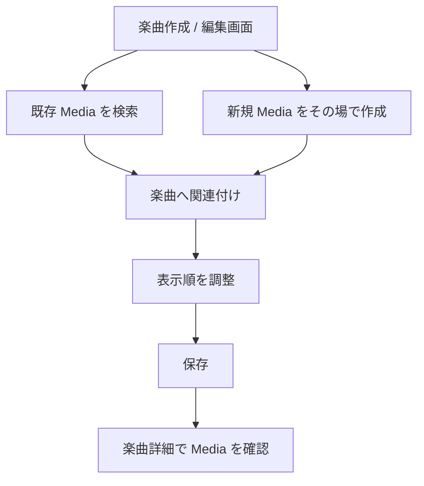

# ドメインモデル草案

## この文書の目的

- ヰ世界情緒に関する情報を、長期的に破綻しない単位で整理する
- 先に「楽曲」軸を完成させて第1回ローンチする
- その後に「出来事」軸を追加して第2回ローンチする
- 会話しながら更新する前提で、現時点の判断と未決事項を同じ文書に残す

## システムの最終ゴール

このシステムが最終的に扱いたい中心概念は 2 つある。

1. 楽曲
2. 出来事

どちらも独立した主役だが、完全に分離されているわけではない。実際には「ある楽曲が、ある出来事で歌われた」「ある出来事に、ある動画や配信アーカイブがある」というように相互に参照し合う。

ただしローンチ順は分ける。

- 第1回ローンチ: 楽曲に関する機能を作り切る
- 第2回ローンチ: 出来事に関する機能を追加する

このため、初期ドメイン設計は「楽曲だけでも閉じる」ことと、「後から出来事を自然に接続できる」ことを両立する必要がある。

最終的には、次のような相互リンクが自然にたどれる状態を目指す。

- 楽曲から関連メディアへたどれる
- メディアから関連する出来事へたどれる
- 出来事から関連する他のメディアや楽曲へたどれる

つまり、`Song`、`Media`、`Event` がそれぞれ孤立した一覧ではなく、相互に回遊できる知識グラフに近い体験を作る。

## ドメインの見方

現時点では、次の 3 層で考えるのが自然。

1. 主役ドメイン
   - 楽曲
   - 出来事
2. 参照ドメイン
   - 人物 / 名義
   - 場所
   - メディア
3. 関係ドメイン
   - 楽曲と人物の関係
   - 楽曲と出来事の関係
   - 出来事とメディアの関係

この切り方にすると、「曲そのもの」「ライブそのもの」と、「誰がどう関わったか」「どの動画が紐づくか」を分離できる。

## ユビキタス言語のたたき台

### 楽曲

歌われる対象そのもの。原曲、カバー、コラボ曲、派生版などを含む、楽曲単位の情報の中心。

### 出来事

ある日時または期間に発生した活動。ライブ、配信、イベント出演、リリース、告知、コラボ施策などを含む。

### 人物

ヰ世界情緒以外も含めた関係者。歌唱者、作詞者、作曲者、編曲者、出演者、ゲストなど。

### 名義

人物そのものではなく、活動上の表示名や参加名義。必要なら将来 `人物` と分ける。
現時点では、実装簡素化のため `人物` に吸収してもよい。

### 場所

物理会場またはオンライン上の開催場所。会場名、プラットフォーム、配信 URL のような概念を含む。

### メディア

YouTube 動画、配信アーカイブ、MV、ショート動画、画像、外部記事など、参照可能なコンテンツ。

## まず固定したい基本方針

### 1. 楽曲と出来事は別集約にする

楽曲は「作品」、出来事は「時点または期間をもつ活動」で性質が違う。
そのため、出来事の一部として楽曲を持つのではなく、別の主役として分ける。

### 2. 関係は中間エンティティで持つ

「どこで」「だれと」「何をした」は、多くが多対多で、かつ関係自体に意味がある。
たとえば「この楽曲を誰が歌唱したか」「この出来事でどの楽曲が披露されたか」は、単純な ID 配列では弱い。

### 3. メディアは横断概念にする

メディアは楽曲専用でも出来事専用でもなく、どちらにも紐づく。
したがって `Media` は独立概念として持ち、関連で結ぶほうが後から伸ばしやすい。

### 4. 第1回ローンチでは出来事依存の概念を楽曲に持ち込まない

たとえば「いつどのライブで歌われたか」は重要だが、これは本質的には出来事ドメインの情報。
第1回ローンチの楽曲モデルでは、これを無理に内包しない。

## ドメイン構造案

## 1. 楽曲ドメイン

第1回ローンチの主役。

### 楽曲エンティティ

`Song`

責務:

- 楽曲を一意に識別する
- 楽曲の基本情報を保持する
- 楽曲に紐づく各種関係の起点になる

持ちたい情報の候補:

- 楽曲 ID
- タイトル
- 種別
  - オリジナル
  - カバー
- 説明
- 表示有無
- 歌詞リンク

### 楽曲の最小必須項目

現時点では、楽曲が「シンプルなものとして存在できる」ための最小必須項目を以下とする。

- タイトル
- 説明
- 種別
  - オリジナル
  - カバー
- タグ
- 表示有無
- 歌詞リンク

補足:

- タグは別途追加編集できる前提だが、分類と検索のため重要なので最小構成に含める
- タグは厳密な主属性ではなく、楽曲の補助属性を柔軟に表現するために使う
- 表示有無は公開制御の最小単位として扱う
- 歌詞リンクは任意属性として持つ
- 歌詞が分からない楽曲もあるため、未設定を許容する
- 作詞者 / 作曲者 / 編曲者は重要な属性だが、現実装に合わせて未設定を許可する
- 歌唱者は最小必須項目に含めない
- 読み、初出日、備考などは将来拡張に回し、初回必須からは外す

ここでいう `楽曲` は「作品としての基本情報」を指す。
したがって、誰が歌ったかは楽曲そのものの属性ではなく、「どの出来事でどう披露されたか」という文脈に属する情報として扱う。
歌詞サイトへのリンクも、`Media` ではなく楽曲の補助属性として扱う。

### 楽曲に対する関係

`SongCreator`

- 誰が作詞 / 作曲 / 編曲したか
- 役割を明示的に持つ

`SongTagging`

- 楽曲の分類・検索補助
- 既存実装の延長線上にある

現時点では、タグは主に「補助属性」を表現するために使う。

例:

- `V.W.P`
- `派生曲`
- `拡声曲`
- `ゲーム`
- `アニメ`

タグの運用方針:

- タグは管理画面で事前登録したものだけを使う
- 楽曲登録時に自由入力では増やさない
- 管理画面に入る利用者は限定される前提で運用する

`SongMediaLink`

- MV、公式音源、歌ってみた動画、ショート動画などを紐づける
- メディア種別と表示順を持てるようにする

`SongMediaLink` は第1回ローンチで扱う主要要素とする。

理由:

- 楽曲そのものは、メディアがなくても成立する
- ただしこのシステムの差別化には、文字情報だけでなくメディアを起点に楽曲をたどれることが重要
- 既存の文字ベース情報サイトや動画ベースサイトとの差別化軸として、楽曲情報とメディアの結び付きが必要
- あとから追加できる性質の情報ではあるが、プロダクト価値としては初回から重要

したがって第1回ローンチ時点では、次の方針にする。

- `Media` 機能は第1回ローンチに含める
- 楽曲ごとにメディアを紐づけて閲覧できる状態を目指す
- ただし楽曲1件ごとの登録時に、メディア入力は必須にしない
- 画像は不要なので、画像前提の設計はまだ入れない

理由:

- ライブでのみ披露され、紐づけ可能な動画や切り抜きが存在しない楽曲がある
- そのため `Media` の有無は楽曲の存在条件にはできない

### 第1回ローンチ時点の関係図

### 楽曲ドメインで扱わないもの

- どこで歌われたか
- いつの出来事で披露されたか
- その披露で誰が歌ったか

これは第2回ローンチの `出来事` と `楽曲出演` の関係で扱う。

## 2. 出来事ドメイン

第2回ローンチの主役。

### 出来事エンティティ

`Event`

責務:

- 出来事を一意に識別する
- 時間、場所、種別を持つ
- その出来事に紐づく楽曲、人物、メディアの起点になる

持ちたい情報の候補:

- 出来事 ID
- タイトル
- 種別
  - ライブ
  - 配信
  - イベント出演
  - リリース
  - 告知
  - コラボ企画
- 開始日時
- 終了日時
- 日付のみか、時刻まで確定しているか
- 説明
- 公開状態
- 備考

### 出来事に対する関係

`EventPlace`

- どこで行われたか
- 物理会場とオンライン会場の両方を表現する

`EventPerformer`

- 誰が出演したか
- 主催、出演、ゲストなどの役割を持てる

`EventMediaLink`

- 告知ポスト、配信 URL、アーカイブ動画、レポート記事などを紐づける

`EventSongPerformance`

- その出来事でどの楽曲が扱われたか
- その披露で誰が歌ったかを表現できる
- 役割として「披露」「初公開」「告知のみ」などを持てる余地がある
- セットリスト順のような順序も持てる

これによって、第2回ローンチで「いつ」「どこで」「どのような出来事か」を自然に表現できる。

### 第2回ローンチ時点の関係図

## 3. 参照ドメイン

### 人物

`Person`

候補:

- 人物 ID
- 表示名
- 読み
- 活動名
- 備考

補足:

既存実装に `Creator` と `Performer` があるなら、短期的にはそれを維持してよい。
ただし長期的には `人物` と `役割` に寄せたほうが、楽曲と出来事の両方で再利用しやすい。

現時点の判断:

- 第1回ローンチでは `Creator` と `Performer` を分けたまま進める
- ただし将来 `Person` に統合しやすい設計を前提にする

理由:

- いま必要な最小構成では、制作者と歌唱者の責務が明確に分かれている
- 歌唱者は作品の基本情報ではなく、披露文脈で変化しうる
- 既存実装との整合を取りやすい
- 第2回ローンチ以降は出来事側で役割の種類が増え、`Person` 統合の価値が上がる

### 場所

`Place`

候補:

- 場所 ID
- 名称
- 種別
  - 会場
  - 配信プラットフォーム
  - URL ベースの開催場所
- 住所または URL
- 備考

### メディア

`Media`

候補:

- メディア ID
- 種別
  - MV
  - 公式音源
  - 歌唱動画
  - 配信アーカイブ
  - ショート動画
  - その他
- タイトル
- URL
- 種別
- 公開日時
- 表示有無
- 表示順
- 公式 / 非公式の区分
- 備考

現時点の判断:

- 第1回ローンチで `Media` を扱う
- 画像は不要
- URL ベースのメディアを先に扱う
- `Media` の最小モデルは `タイトル / URL / 種別 / 表示有無 / 表示順` とする
- 初期の `Media` 種別は `MV / 公式音源 / 歌唱動画 / 配信アーカイブ / ショート動画 / その他` とする
- 既存種別に当てはまらない動画 URL は `その他` を使う
- 楽曲に紐づける `Media` は公式のものだけを扱う

## 集約の境界案

### 第1回ローンチ時点

- `Song` 集約
- `SongTag` 集約
- `Creator` 集約
- `Performer` 集約

補足:

`Media` は第1回ローンチに含める。
差別化の中心機能なので、後回しにはしない。

### 第2回ローンチで追加

- `Event` 集約
- `Place` 集約
- `EventSongPerformance` を含む出来事関連の関係

ポイントは、第1回ローンチでは `Song` を中心に閉じたユースケースを成立させること。
`Event` がなくても楽曲情報の登録、検索、表示が回る必要がある。

## ローンチ戦略

## 第1回ローンチ: 楽曲を完成させる

補足:

`Song` / `Creator` / `Performer` / `SongTag` については、すでに `src/server/packages` に基盤実装が存在する。
したがって第1回ローンチの主眼は、これらをゼロから作ることではなく、既存基盤を前提に `admin` での運用を完成させ、`Media` を含めた楽曲体験を成立させることにある。

### この時点で達成したいこと

- ヰ世界情緒が歌ってきた楽曲を一通り登録できる
- 楽曲ごとに関係者を整理できる
- 楽曲ごとにメディアを整理できる
- 楽曲タグや種別で検索・一覧できる
- 出来事情報がなくても、楽曲単位の知識ベースとして成立する
- 既存の文字ベース情報サイトや動画ベースサイトと異なる体験を提供できる

第1回ローンチ準備では、まず `admin` を優先する。

理由:

- 先に管理画面でデータを正しく登録 / 編集 / 関連付けできる状態を作る必要がある
- `viewer` はまだデザインが固まっておらず、先に詰める対象ではない
- `viewer` の価値は `admin` 側で十分な楽曲 / タグ / `Media` データを持ててから最大化される

### 最低限必要な機能

- 楽曲 CRUD
- 楽曲種別管理
- 楽曲タグ管理
- 歌唱者 / クリエイター管理
- 楽曲とメディアの関連付け
- 楽曲検索
- 楽曲詳細表示

### 第1回ローンチの具体スコープ

#### 必須

- 楽曲の作成 / 編集 / 表示 / 一覧
- 楽曲の最小属性
  - タイトル
  - 説明
  - 種別
  - タグ
  - 表示有無
  - 歌詞リンク
- 作詞者 / 作曲者 / 編曲者の登録と関連付け
  - 未設定は許容する
- 楽曲タグの事前登録と関連付け
- 楽曲に対する公式 `Media` の登録と関連付け
- `Media` の最小属性
  - タイトル
  - URL
  - 種別
  - 表示有無
  - 表示順
- `Media` は楽曲作成 / 編集画面の中で追加 / 削除 / 並び替えできること
- 楽曲作成 / 編集画面では、既存 `Media` の選択と、その場での新規 `Media` 作成の両方を許容する
- UI は `既存 Media 検索` と `新規 Media 追加フォーム` の 2 段構成を基本とする
- 管理画面の楽曲詳細から関連 `Media` を閲覧できること
- 管理画面の楽曲詳細は、現在表示している情報に `Media` を追加する形を基本とする
- タグ / 種別 / 表示有無を軸にした楽曲検索

#### あると望ましい

- `Media` 側から関連楽曲へ戻れる導線
- 楽曲詳細での `Media` 並び替え UI
- タグ別の楽曲一覧
- 作詞者 / 作曲者 / 編曲者別の楽曲導線

#### 第1回ではやらない

- 管理画面での `Media` 単独一覧ページ
- `viewer` の詳細な情報設計やデザイン確定
- 出来事 CRUD
- 場所管理
- 楽曲がどの出来事で披露されたかの管理
- 歌唱者を楽曲本体に持つこと
- セットリスト
- 時系列ベースの出来事表示
- 画像メディア対応
- 非公式 `Media` の取り扱い

#### `admin` における `Media` 操作フロー

### 第1回では保留してよいもの

- セットリスト
- 楽曲がどのライブで歌われたか
- ライブ / 配信の時系列表示
- 出来事単位のページ

## 第2回ローンチ: 出来事を追加する

### この時点で達成したいこと

- ヰ世界情緒が関わった出来事を時系列で登録・検索できる
- 出来事ごとに場所、出演者、メディアを整理できる
- 出来事と楽曲を結び付けて、披露履歴や初出情報を扱える

### 最低限必要な機能

- 出来事 CRUD
- 出来事種別管理
- 場所管理
- 出来事と楽曲の関連付け
- 出来事検索
- 出来事詳細表示

## 実装順の道のり

### 第1回ローンチまでの実装タスク

1. 既存の楽曲基盤の扱いを固定する
   - `Song` / `Creator` / `Performer` / `SongTag` の既存責務を前提にする
   - タイトル / 説明 / 種別 / 表示有無 / クリエイター未設定許容の運用を合わせる
2. 既存のタグ / クリエイター基盤を `admin` で使い切れる状態にする
   - タグの事前登録
   - 楽曲へのタグ関連付け
   - 作詞者 / 作曲者 / 編曲者との関連付け導線
3. `Media` モデルを追加する
   - タイトル / URL / 種別 / 表示有無 / 表示順
   - 公式メディアのみ扱う
4. 楽曲と `Media` の関連付けを完成させる
   - 楽曲詳細で関連メディアを表示する
   - 表示順で制御できるようにする
   - 楽曲作成 / 編集画面の中で `Media` を管理できるようにする
   - 既存 `Media` の選択と、その場での新規 `Media` 作成の両方をできるようにする
   - UI は `既存 Media 検索` と `新規 Media 追加フォーム` の 2 段構成を基本とする
5. `admin` の楽曲運用体験を固める
   - 種別 / タグ / 表示有無で探せる
   - 管理画面の楽曲詳細から関連 `Media` へたどれる
   - 楽曲詳細は既存表示情報をベースにし、追加差分は `Media` 中心に絞る
6. 第1回ローンチ前の品質整理
   - 入力ルールの最終確認
   - 不要機能を入れない
   - 差別化体験が出ているか確認する

## フェーズ 1: 楽曲の基礎を固める

- `Song` の必須属性を確定する
- 既存の `Creator` / `Performer` / `SongTag` モデルとの責務境界を確定する
- 楽曲詳細に必要な情報を洗い出す

## フェーズ 2: 楽曲を知識ベースとして成立させる

- 楽曲と関係者の関連を完成させる
- 楽曲とメディアの関連を完成させる
- 登録 / 一覧 / 詳細 / 検索を一貫させる

## フェーズ 3: 楽曲ローンチ

- データ入力フローを安定させる
- 表示上の不足を埋める
- 第1回ローンチ

## フェーズ 4: 出来事ドメインを追加する

- `Event` と `Place` を導入する
- `Song` と `Event` の関連を導入する
- 時系列と出来事詳細を成立させる

## フェーズ 5: 出来事ローンチ

- 出来事一覧 / 詳細 / 検索を安定させる
- 楽曲との横断導線を整える
- 第2回ローンチ

## 現時点の重要な設計判断

### 1. 「どこで」は楽曲の直接属性にしない

「どこで歌われたか」は楽曲そのものの性質ではなく、出来事との関係で決まる。
したがって `Song.place` のような属性は持たない。

### 2. 「だれと」は関係として持つ

コラボ相手、歌唱参加者、制作参加者は、文字列属性ではなく関係エンティティとして持つ。
これにより検索や再利用がしやすくなる。

特に歌唱参加者は楽曲本体ではなく、出来事における披露関係として持つ。

### 2.5. タグは補助属性として使う

タグは、楽曲の主たる定義を担うものではなく、補助属性を柔軟に表現するための仕組みとして使う。

現時点で想定している用途:

- 所属・文脈
  - `V.W.P`
- 楽曲の呼称・形態
  - `派生曲`
  - `拡声曲`
- タイアップ文脈
  - `ゲーム`
  - `アニメ`

この設計にすると、初期段階で専用属性を増やしすぎずに済む。
一方で、後に利用頻度が高いタグ群が見えてきたら、独立属性や別集約へ昇格させる余地を残せる。

現時点では、タグを系統で分けない。

理由:

- 管理画面の利用者が限定されており、運用で語彙を揃えやすい
- 初期段階でタグ分類の仕組みまで入れると複雑さが増える
- まずは単一のタグ集合として運用し、必要になった時点で系統追加を検討すればよい

### 3. メディアは独立させる

URL を楽曲や出来事に直接ベタ書きせず、`Media` として持つ。
同じ動画が楽曲詳細と出来事詳細の両方に出る可能性があるため。

ただし第1回ローンチでは、`Media` は任意要素として扱う。
ただしここでいう任意とは「各楽曲に必須入力とは限らない」という意味であり、機能自体は第1回ローンチに含める。
画像も現時点では不要なので、画像前提の設計は持ち込まない。

補足:

`Media` は「完全に楽曲の子要素」と見るには弱く、「汎用の独立マスタ」と見るには楽曲との結び付きが強い。
そのため、現時点では次の 2 層で考えるのが妥当。

- `Media`
  - URL、タイトル、種別、表示有無のようなメディアそのものの情報を持つ
- `SongMediaLink`
  - どの楽曲に紐づくか
  - どの順で見せるか

第1回ローンチ時点では、`SongMediaLink` が持つ属性は最小限に絞る。

- `song_id`
- `media_id`
- `order_no`

この切り方なら、第1回ローンチでは楽曲に強く結び付いた `Media` を扱いつつ、第2回で出来事との関連が必要になったときも破綻しにくい。
つまり、`Media` は独立エンティティ、`SongMediaLink` は楽曲文脈を表す関係エンティティとして扱う。

ただし第1回ローンチ時点では、`Media` の対象は楽曲に関連するものへ限定する。
記事のような拡張は入れず、まずは楽曲と直接結び付くメディアだけを扱う。

運用上の補足:

- 同一アーカイブを複数楽曲に結び付けることを許容する
- 楽曲ごとに参照したい箇所が異なる場合は、秒数などを含めて別 `Media` として扱ってよい

これにより、「同じ配信アーカイブの中で複数楽曲が披露されている」ケースと、「特定楽曲の該当箇所を明示したい」ケースの両方を扱える。

### 4. 第1回ローンチでは「楽曲の完全性」を優先する

出来事が未実装でも、楽曲単位で見たときに情報が不足しすぎないことを優先する。
ただし必須項目は増やしすぎず、まずは最小構成で登録可能にする。

### 5. 楽曲種別は当面 2 値でよい

現時点では、楽曲種別は以下の 2 つで十分と判断する。

- オリジナル
- カバー

この判断で大きな問題はない。

理由:

- 最小構成としてわかりやすい
- 登録ルールがぶれにくい
- 先に複雑な分類を入れると、定義の揺れが増える

将来必要になったら、種別追加か別軸のタグで拡張する。

## 未決事項

以下は会話しながら詰めたい。

1. `Creator` と `Performer` を長期的に `Person` へ統合するか
2. 将来 `オリジナル / カバー` 以外の分類が必要になったとき、種別追加で対応するか、別軸で表現するか
3. 楽曲の「初出」を何で定義するか
   - 初公開日
   - 初歌唱日
   - 初投稿日
4. 出来事に「リリース」や「告知」を含めるか
   - ライブや配信だけに絞るか
   - もっと広く活動全体を扱うか
5. 1つの楽曲に複数のバージョンがある場合の表現
   - 別楽曲にするか
   - 親子関係を持たせるか
6. 第2回ローンチ時に、既存 `Media` を `Event` とどう接続するか
   - `EventMediaLink` を追加する
   - `SongMediaLink` と役割をどう分けるか

## 直近で次に詰めるべきこと

第1回ローンチを成功させるため、次は `admin` で必要な画面と操作をどこまで作るかを詰めたい。
特に以下を決めると、楽曲ドメインがかなり固まる。

- 第2回ローンチで `EventSongPerformance` にどこまで歌唱文脈を持たせるか
