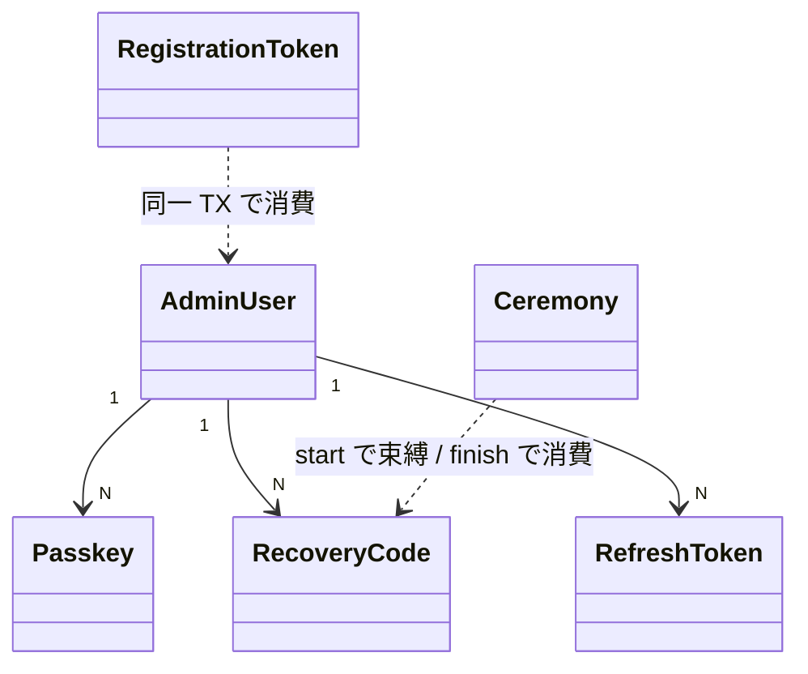

# Admin Auth Spec

関連: ADR-0016 / ADR-0017 / ADR-0018

## 用語

- 管理認証は **WebAuthn passkey** のみ。password は持たない
- Ceremony は `start` / `finish` (login / register / recovery)
- セッションは access JWT + refresh token
- **招待トークン**: CLI `admin:invite` が email・role・permissions を固定して発行。TTL 7 日
  平文は標準出力へ一度だけ。DB はハッシュ。発行時点では `admin_users` 行を作らない
- **リカバリーコード**: 既定 10 個。平文は発行時のみ。DB はハッシュ。所有は Auth パッケージ
- Role: Privilege / Console / General。Permission は資源ごとの read / write など

## できること

- 未ログイン: login / 招待付き register / recovery の start・finish、および refresh
- ログイン後: リカバリーコードの発行・再生成 (既存を消して新規 10 個)
- 復旧成功時は既存 passkey を残し、新しい passkey を追加する
- 登録・復旧の失敗詳細は汎用エラーへ丸める (入力形式違反のみ 422)

## できないこと

- password 認証や password 互換を持たない
- 自己登録を持たない (招待トークン必須)
- 登録完了時の自動リカバリーコード発行や、CLI からのコード発行はしない
- Viewer に認証はない (Admin のみ)
- Admin API からのユーザー作成・権限変更は持たない (招待は CLI)

## 主な関係

